# Marketing Analytics with SQL — Campaign Efficiency & Funnel Insights

## Overview
This part of the portfolio demonstrates SQL-based marketing analytics using **Google BigQuery** and ad performance data from **Facebook Ads** and **Google Ads**.  
The tasks replicate typical business questions around **spend efficiency, funnel metrics, and campaign attribution**, with step-by-step problem solving.

---

## Task 1 — Spend Efficiency (Facebook Ads Basic Daily)

**Business Objective:**  
Evaluate advertising efficiency by analyzing spend relative to clicks.

**Key Steps:**
1. Connect to the database and review the `facebook_ads_basic_daily` schema.  
2. Extract `ad_date`, `spend`, `clicks`, and calculate **Cost per Click (CPC)** as `spend/clicks`.  
3. Filter out records with zero clicks.  
4. Sort the dataset by `ad_date` in descending order.  

**Business Value:**  
Provides a first look at spend efficiency, helping marketers quickly identify dates with unusually high CPC.

Script | Output
:---: | :---:
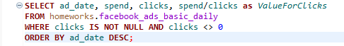 | 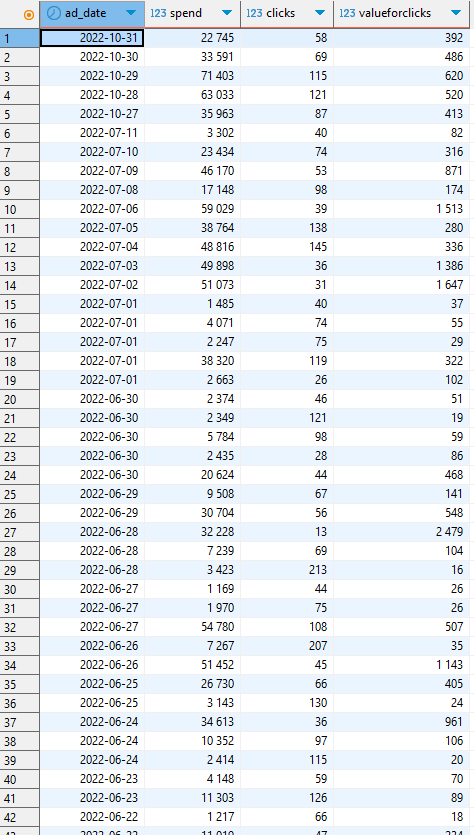

---

## Task 2 — Campaign-Level Aggregation & Metrics

**Business Objective:**  
Calculate campaign performance metrics to benchmark across days and campaigns.

**Key Steps:**
1. Aggregate by `ad_date` and `campaign_id`:
   - Total spend  
   - Impressions  
   - Clicks  
   - Conversion value  
2. Compute efficiency metrics:
   - **CPC** (Cost per Click)  
   - **CPM** (Cost per 1,000 Impressions)  
   - **CTR** (Click-Through Rate)  
   - **ROMI** (Return on Marketing Investment).  

**Business Value:**  
Delivers actionable KPIs at the campaign level, essential for daily optimization and budget allocation.

Script | Output
:---: | :---:
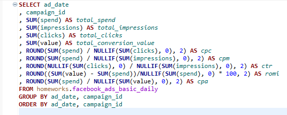 | 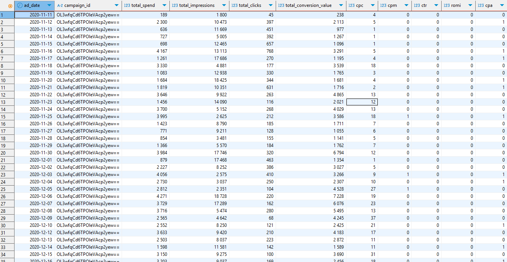

---

## Task 3 — Unified Facebook & Google Spend View

**Business Objective:**  
Consolidate marketing data across **Google Ads** and **Facebook Ads** for unified reporting.

**Key Steps:**
1. Create a CTE to combine daily data with a derived `media_source` column (`Google Ads` / `Facebook Ads`).  
2. Aggregate by `ad_date` and `media_source`:  
   - Total spend  
   - Impressions  
   - Clicks  
   - Conversion value  

**Business Value:**  
Provides a cross-channel view of media performance, enabling comparison between platforms and supporting media mix decisions.

Script | Output
:---: | :---:
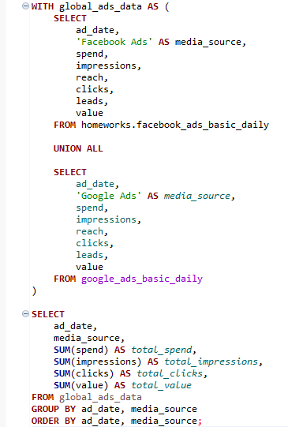 | 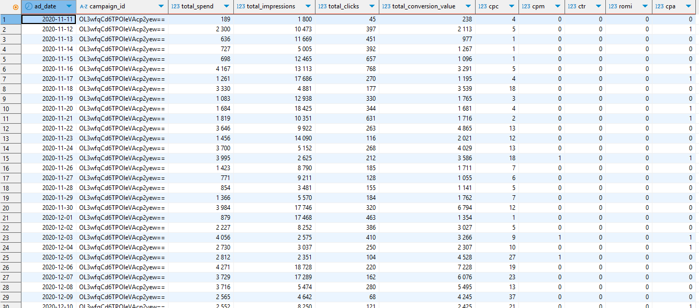

---

## Task 4 — Detailed Campaign & Adset Reporting

**Business Objective:**  
Produce a granular report that links **campaigns** and **adsets** across Facebook and Google Ads.

**Key Steps:**
1. Use CTE with **LEFT JOINs** to enrich Facebook daily data with campaign and adset metadata.  
2. Combine with Google Ads data using `UNION ALL`.  
3. Group by `ad_date`, `media_source`, `campaign_name`, and `adset_name` to calculate:  
   - Spend  
   - Impressions  
   - Clicks  
   - Conversion value  

**Business Value:**  
Enables **deep-dive analysis** into campaign/adset performance, crucial for A/B testing and creative optimization.

Script | Output
:---: | :---:
 | 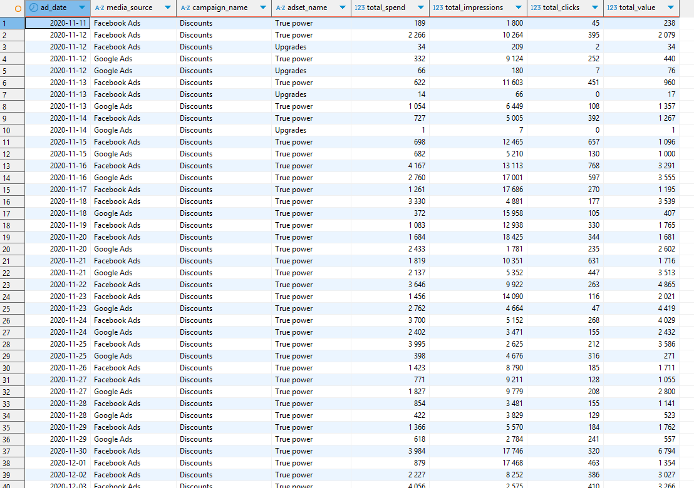

---

## Task 5 — UTM Campaign Analysis with CTR, CPC, CPM, ROMI

**Business Objective:**  
Enrich campaign-level reporting with **UTM attribution** for better marketing insights.

**Key Steps:**
1. Create CTE to unify Facebook and Google Ads data.  
2. Extract `utm_campaign` from `url_parameters`:  
   - Convert to lowercase.  
   - Replace `"nan"` values with `NULL`.  
3. Calculate per-date, per-campaign metrics:  
   - Spend, Impressions, Clicks, Conversion Value  
   - CTR, CPC, CPM, ROMI (using CASE to avoid division by zero).  

**Business Value:**  
Bridges ad platform data with tracking parameters, allowing performance evaluation at the campaign tag level.

Script | Output
:---: | :---:
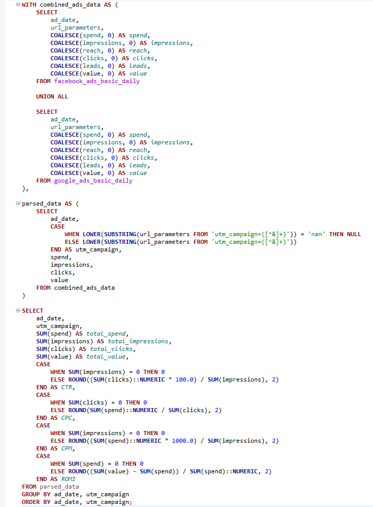 | 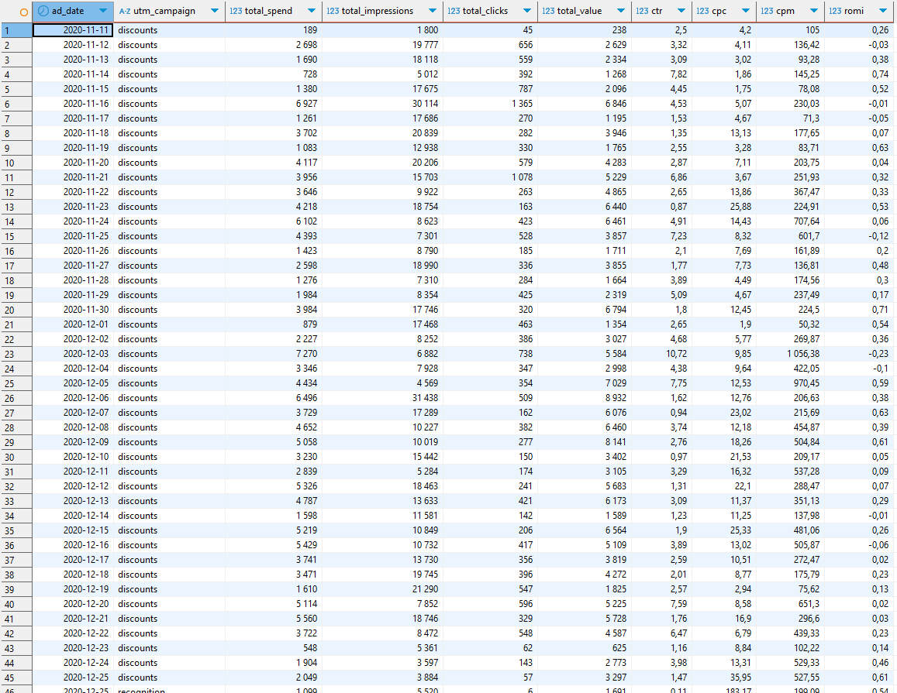

---

## Task 6 — Monthly Campaign Dynamics

**Business Objective:**  
Measure **month-over-month trends** in campaign efficiency.

**Key Steps:**
1. Extend Task 10 CTE with monthly aggregation (`ad_month`).  
2. Summarize metrics per `utm_campaign` and month:  
   - Spend, Impressions, Clicks, Conversion Value  
   - CTR, CPC, CPM, ROMI  
3. Add **MoM differences (%)** for CPM, CTR, ROMI compared to the previous month.  

**Business Value:**  
Supports trend analysis, enabling marketers to identify growth, decline, and seasonality in campaign performance.

Script | Output
:---: | :---:
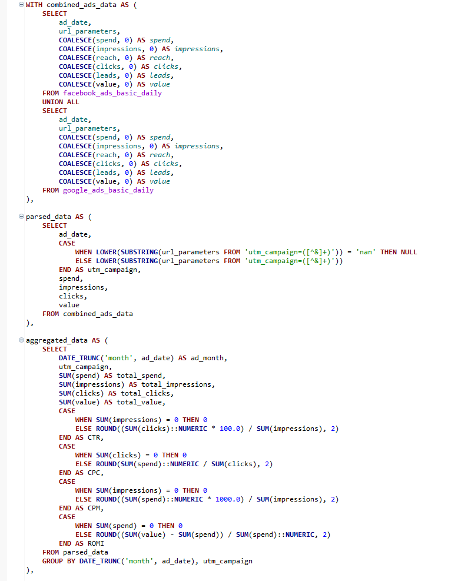 | 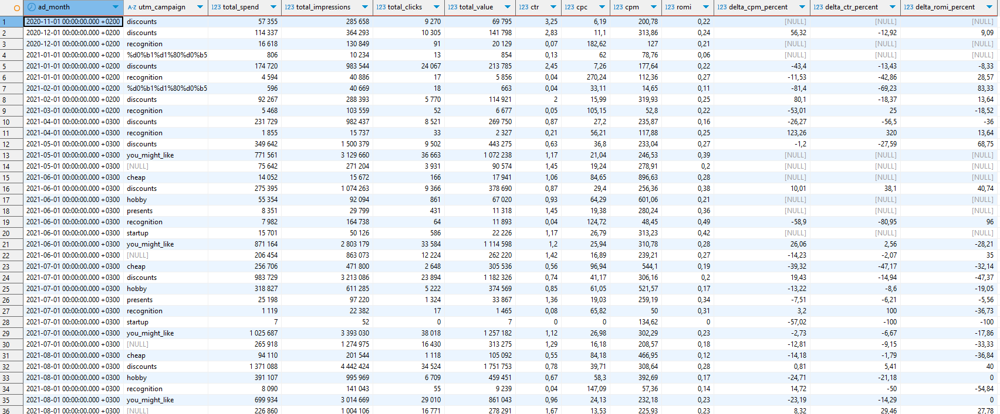

---

## Tools & Technologies
- **Google BigQuery** — SQL querying and aggregation.  
- **Facebook Ads & Google Ads Data** — Core marketing datasets.  
- **SQL (CTE, JOIN, Aggregation)** — Main analysis techniques.  
- **BI-ready outputs** — Optimized for dashboards and reporting.

---

## Business Impact
- **Cross-Platform Integration:** Unified Google & Facebook reporting.  
- **Campaign Optimization:** CPC, CPM, CTR, ROMI at daily, campaign, and adset level.  
- **Attribution Insights:** UTM-based campaign breakdowns.  
- **Trend Analysis:** MoM performance dynamics supporting long-term strategy.  
